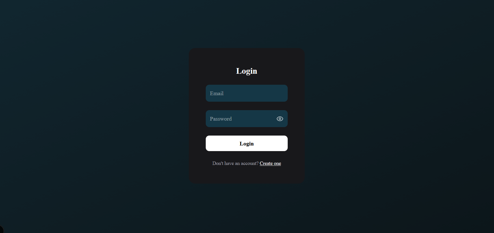
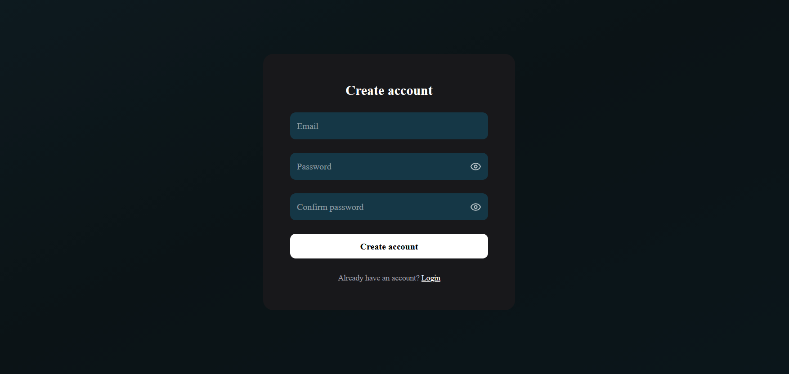
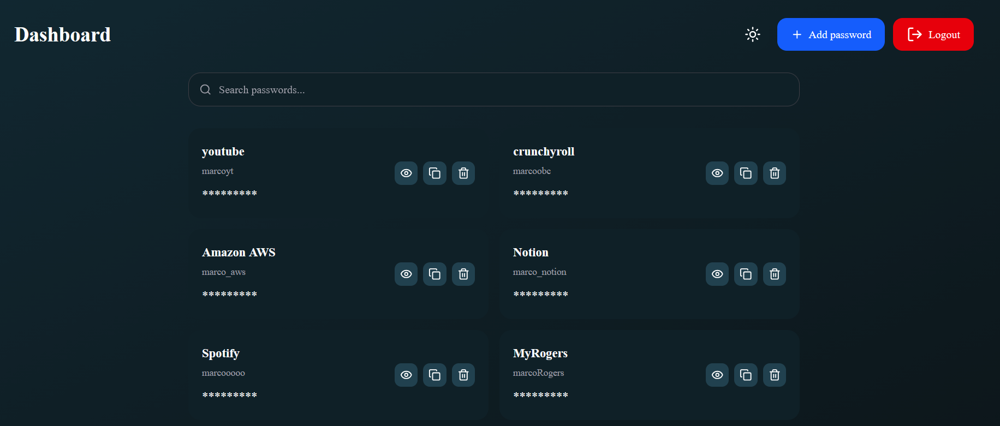
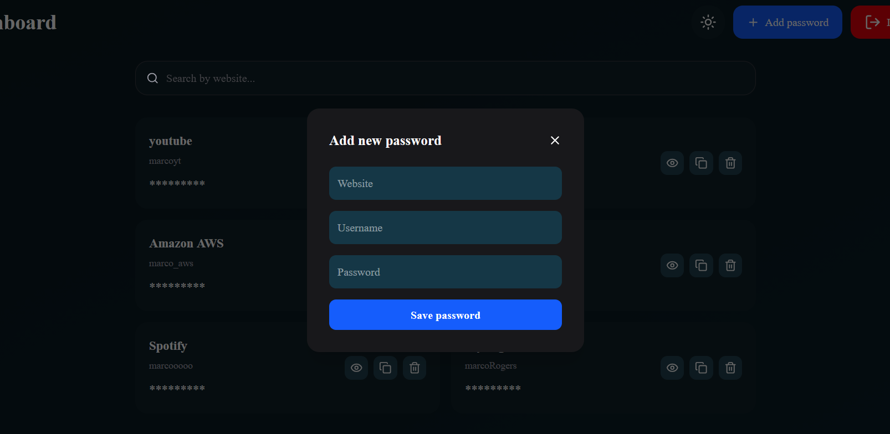

# Lockerpass - Password Manager App
A full-stack password manager web application built with modern technologies.
Users can securely store, view, and manage their credentials through an intuitive and responsive interface.

## 🔑 Demo Account
You can explore the app using this test account:
```bash
Email: guest@gmail.com
Password: guest123
```

## 🚀 Live Demo
- 🌐 Frontend: <a href="https://www.lockerpass.site/login" target="_blank">🔗 Open App</a>
- 📚 API Docs: <a href="https://passwords-manager-api.onrender.com/docs#/default" target="_blank">📚 Open Swagger Docs</a>

## 📸 Screenshots

### 🔐 Authentication

<p align="center">
  <a href="https://www.lockerpass.site/login" target="_blank">
    
  </a>
  <a href="https://www.lockerpass.site/register" target="_blank">
    
  </a>
</p>

### 📊 Dashboard
Securely view and manage your stored credentials in a clean interface.



### 🔑 Password Management


## 🛠️ Tech Stack
### 🎨 Frontend
Next.js (App Router)
React
TypeScript
Tailwind CSS
Zustand (global state management)
Framer Motion (animations)
Lucide Icons

### ⚙️ Backend
FastAPI (Python)
JWT Authentication
bcrypt (password hashing)
python-jose (token handling)
psycopg2 (database connection)

### 🗄️ Database
Supabase (PostgreSQL)

### ☁️ Deployment
Frontend: Vercel
Backend: Render
Database: Supabase

## 📦 Installation (Local Development)
## Backend
```bash
cd api
python -m venv venv
source venv/bin/activate  # or venv\Scripts\activate on Windows
pip install -r requirements.txt
uvicorn app.main:app --reload
```

## Frontend

```bash
cd client
npm install
npm run dev
```
